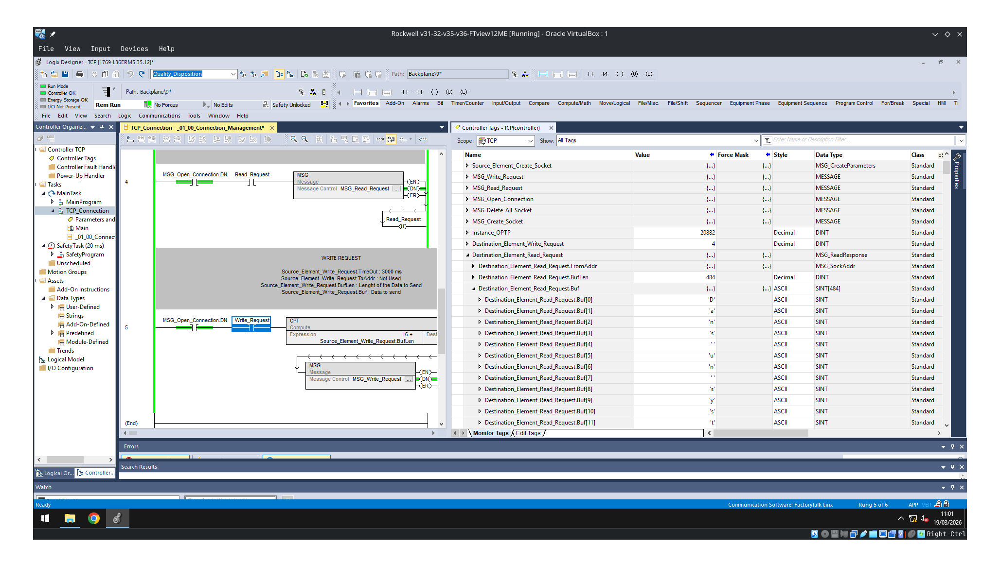
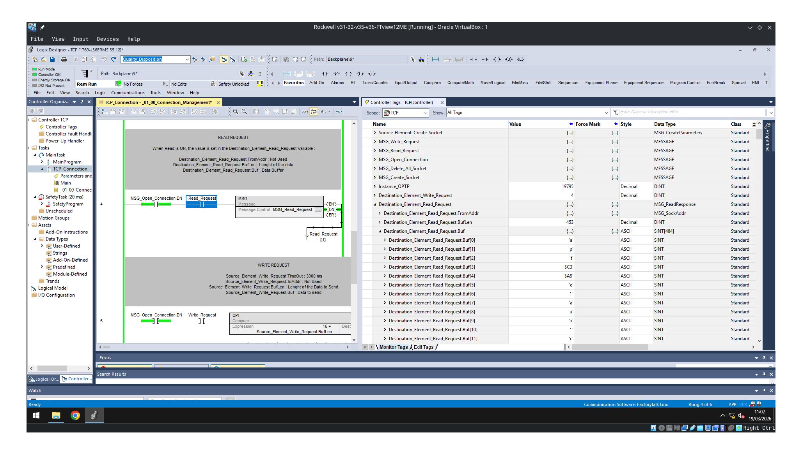
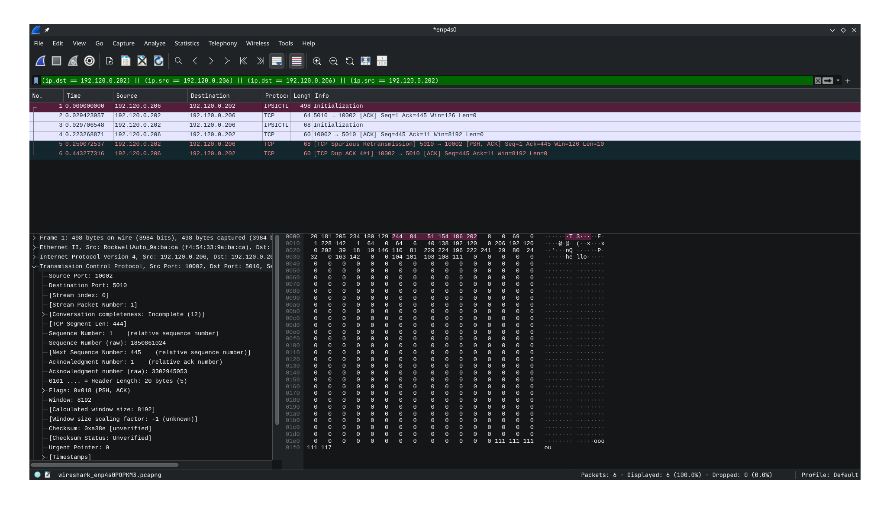
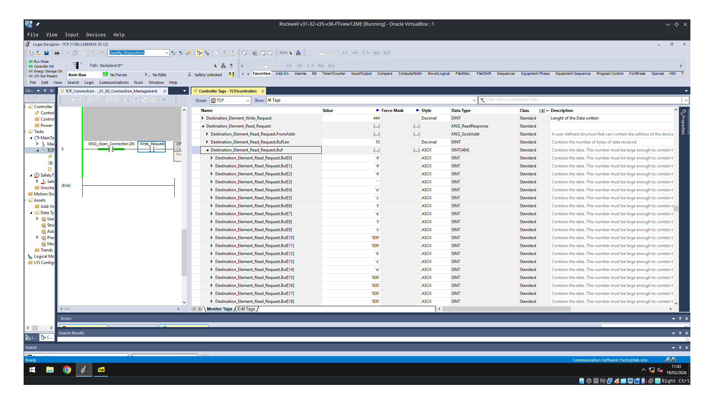
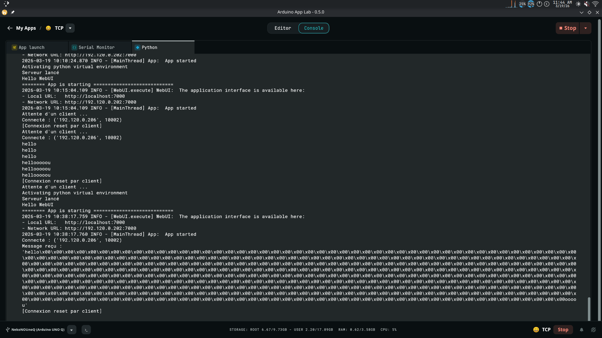

# Analyse des echanges de trames TCP entre Arduino Uno_Q et Rockwell 1769-L36ERMS

## Ordre des testes :
 - Une Grosse trame envoyer Arduino -> Rockwell
 - Une Grosse trame envoyer Rockwell -> Arduino
 - Plein de trames envoyer Arduino -> Rockwell
 - Plein de trames envoyer Rockwell -> Arduino

### Une Grosse trame envoyer Arduino -> Rockwell 

Sequence observer avec Wireshark :

    PLC → PC : "semp" (4 bytes)
    PC → PLC : ACK
    PC → PLC : gros message (937 bytes)
    PLC → PC : ACK

#### Probleme rencontrer :
Coter Rockwell les trames maximale etait de 484 bytes, donc meme si il repond avec un ok on ne peux pas toutes les lires en une seule fois,
les trames sont belle et bien toutes stocker dans le buffer mais pas possible de lire plus de 484 lors d'un read socket :

#### Solution aporter :
Ajouter un checker sur le buffer, si celui-ci est plein, on vient le stocker dans un buffer plus grand et on relit la trame puis on ajoute a la fin du buffer

---

### Une Grosse trame envoyer Rockwell -> Arduino

Pour ce test j'ai envoyer la taille maximale du buffer soit 460 (taille des donnees 460 - 16);

    PLC → "hello + padding"
    PC → ACK

    PC → "444 octets"
    PLC → ACK

    PC → renvoie ENCORE "444 octets"
    PLC → duplicate ACK

Je pense que la tramme doubler est une erreur de mon programme mais je n'ai pas fait plus de teste que ca.

La board resoit bien les 444 octetes emit et le PLC 

---

