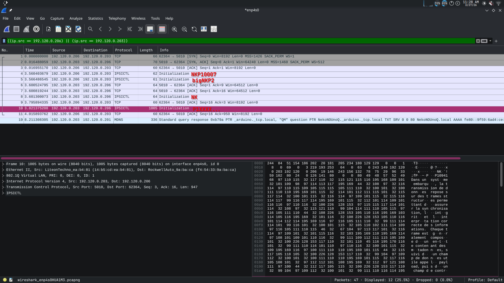
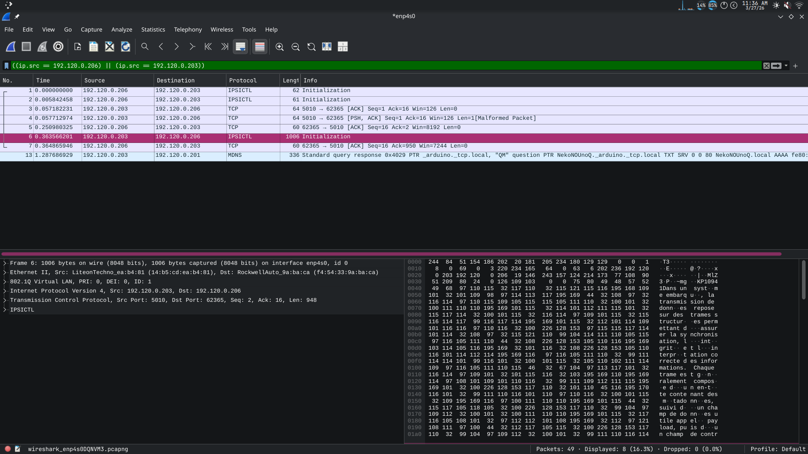
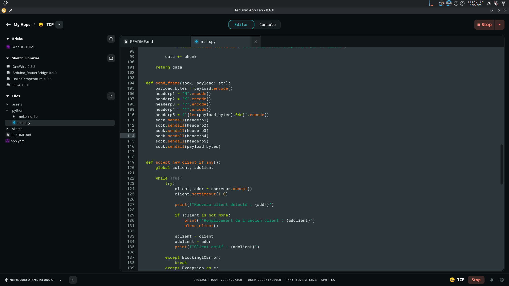
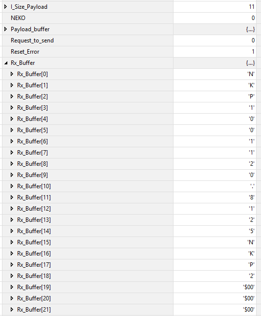
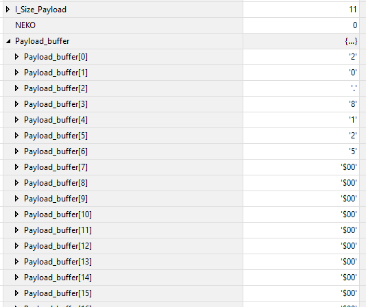

# Analyse du Protocole TCP

## Objectif
Valider le comportement du protocole de communication face à différentes stratégies d’envoi des données (header et payload), en observant :
- le comportement du réseau (Wireshark)
- le comportement côté automate Rockwell (buffer + parsing)

Le protocole repose sur :
- un **header fixe** : `NKP1XXXX`
  - `NKP1` : signature
  - `XXXX` : taille du payload (zéro-padding)
- suivi du **payload et du footer**

---

## Tests effectués

### 1. Header envoyé en deux parties

Le header est volontairement découpé en deux envois TCP distincts.

#### Observation Wireshark
Le header apparaît bien en **deux trames TCP distinctes**.

#### Observation côté Rockwell
- Les données sont **correctement reconstituées dans le buffer TCP**
- Le parsing fonctionne normalement
- Aucun impact fonctionnel

#### Conclusion
Le protocole est robuste à un **header fragmenté**.
→ Conforme au fonctionnement TCP (stream, pas message-based)

---

### 2. Header envoyé byte par byte

Chaque byte du header est envoyé individuellement.

#### Observation Wireshark
Contrairement à l’attente :
- Les bytes ne sont pas forcément visibles comme des trames séparées
- Le TCP **regroupe automatiquement les petits envois**

  

#### Explication technique
TCP est un protocole **orienté flux (stream)** :
- Il n’y a **aucune garantie de découpage des paquets**
- Le système réseau (stack TCP) peut :
  - fusionner les envois 
  - bufferiser avant envoi

#### Observation côté Rockwell
- Réception en un bloc
- Parsing fonctionnel

#### Conclusion
Envoyer byte par byte :
- N’a aucun intérêt en TCP
- Ne garantit pas une séparation réseau
- Le protocole reste fonctionnel grâce au parsing basé sur contenu

---

### 3. Header + Payload envoyés en une seule trame

Envoi classique : header + payload en une fois.

#### Observation Wireshark
- Une seule trame contenant l’ensemble des données

#### Observation côté Rockwell

Buffer brut :

Données décodées :

#### Conclusion
- Comportement attendu
- Parsing immédiat possible

---
## Implications pour le protocole

### Points validés
Le protocole fonctionne dans tous les cas  
Le parsing basé sur :
- signature (`NKP1`)
- taille (`XXXX`)
est correct  

Le buffer Rockwell contient bien toutes les données  

---

### Points critiques identifiés

#### 1. Dépendance au buffer
Rockwell ne peut lire qu’un nombre limité de bytes par `Read Socket` (~484 bytes observé)

Obligation de :
- lire en plusieurs fois
- reconstruire côté automate

---

#### 2. Nécessité d’un parsing robuste

Le système doit :
1. Chercher la signature (`NKP1`)
2. Lire la taille
3. Attendre que tout le payload soit reçu
4. Traiter uniquement quand complet

---

## Conclusion

Le protocole est **valide et robuste** face aux comportements réels du TCP :

- Fragmentation → OK  
- Regroupement → OK  
- Envoi massif → OK  
